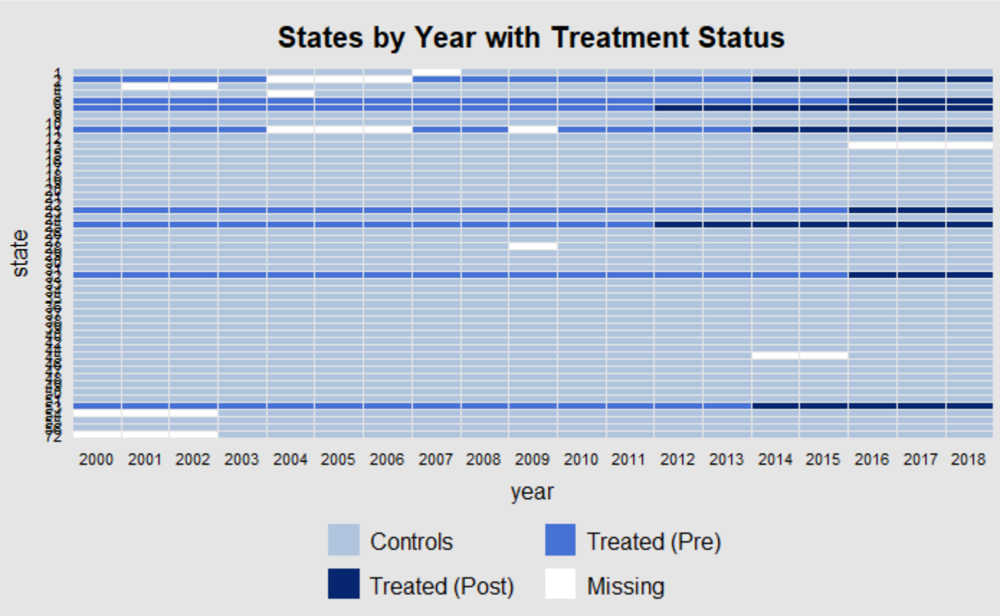

# Purpose

---

This work was started in a graduate class and then continued and completed by me on my own time and out of my own 
curiosity. I wanted to review previous work I had done looking at opioid addiction and marijuana policy. This work
checks my previous thesis (see undergrad-thesis-opioid-addiction repo) by adding in new data and using two different 
and more modern methodologies. The first model I use is a Synthetic Control, and the second is a Stability-Controlled 
Quasi-Experiment. Both models come to the same conclusion, that unlike my previous work there is not significant
evidence that marijuana policy reduces rehabilitation rates for opioid addiction. 

# Data, Models, and Results

---

The data used for this work comes from the Treatment Episode DataSet-Admissions or TEDS-A for short. It covers most
but not all states for the years 2000-2018. Below is a graphic of the states and their treatment status. 

The light blue indicates that states are controls, the mid-blue means they are treated states in a pre-treatment period,
the dark-blue indicates that it is a treatment state in the treated period, and finally white means there is a missing
observation. More information about the data can be found in the Documentation folder. Now its time to move onto the 
models that were employed in this work. 

The first model used was a Synthetic Control. This method works by using the untreated states to form a composite or
"synthetic" version of a control state. This faux state is built using the pre-period data and should track along
closely to the treated state up to the application of treatment. If the synthetic control moves along perfectly in the
pre-period then if nothing happens during treatment it should continue to track in the post period. The divergence around
treatment is where we derive our causal estimate. This work found little divergence after legalization and therefore
concludes that there is no significant effect of legalizing marijuana on mitigating opioid addiction. The next model uses
a different estimation strategy.

Stability-Controlled Quasi-Experiment is a new methodology that has a more relaxed set of assumptions than most of its
causal counterparts. On the surface it is an Instrumental Variable model that uses time as the instrument. It works
by comparing the expected value in the pre-period to the difference in the post-legalization control and treatment groups.
Then the researcher must look at a range of potential values of the outcome, we call this delta, and argue whether the
difference could have happened in the absence of treatment. So instead of arguing that the researcher controlled for
all exogenous variation, I look at how much variation I would need to have missed for the result to have changed, then
argue that there is not enough bias present to alter the findings. I found that in order for the results of this model
to show that there has been a significant effect on opioid treatment there would need to have been a 30% increase in admissions
for opioids in a year. This is too large of an amount to be reasonable, so we find that there is insubstantial evidence to
reject the null hypothesis that there is no effect from marijuana policy on opioid admissions. 

# References  

---

1. Berke, Jeremy. "New Jersey Lawmakers Postponed a Critical Vote to Legalize Marijuana - Here Are All the State/territories Where Pot Is Legal." Business Insider. March 26, 2019. Accessed April 23, 2019. https://www.businessinsider.com/legal-marijuana-state/territorys-2018-1.

2. National Institute on Drug Abuse. "Overdose Death Rates." NIDA. January 29, 2019. Accessed April 23, 2019. https://www.drugabuse.gov/related-topics/trends-statistics/overdose-death-rates.

3. Yasmin L. Hurd,
Cannabidiol: Swinging the Marijuana Pendulum From ‘Weed’ to Medication to Treat the Opioid Epidemic,
Trends in Neurosciences, Volume 40, Issue 3,2017,Pages 124-127, ISSN 0166-2236, https://doi.org/10.1016/j.tins.2016.12.006.
(http://www.sciencedirect.com/science/article/pii/S0166223617300012) Abstract: Epidemics require a paradigm shift in thinking about all possible solutions. The rapidly changing sociopolitical marijuana landscape provides a foundation for the therapeutic development of medicinal cannabidiol to address the current opioid abuse crisis.

4. "Treatment Episode Data Set: Admissions (TEDS-A)." Treatment Episode Data Set: Admissions (TEDS-A) | SAMHDA. Accessed December 09, 2020. https://www.datafiles.samhsa.gov/study-series/treatment-episode-data-set-admissions-teds-nid13518.

5. Gsynth: Generalized Synthetic Control Method. Accessed December 09, 2020. https://yiqingxu.org/software/gsynth/gsynth_examples.html.

6. lberto Abadie, Alexis Diamond & Jens Hainmueller (2010) Synthetic Control Methods for Comparative Case Studies: Estimating the Effect of California’s Tobacco Control Program, Journal of the American Statistical Association, 105:490, 493-505, DOI: 10.1198/jasa.2009.ap08746

7. Chad Hazlett, David Ami Wulf, Bogdan Pasaniuc, Onyebuchi Arah, Kristine M Erlandson, Brian T Montague Credible learning of hydroxychloroquine and dexamethasone effects on COVID-19 mortality outside of randomized trials, medRxiv 2020.12.06.20244798; doi: https://doi.org/10.1101/2020.12.06.20244798

8. Chadhazlett. "Chadhazlett/scqe: Stability Controlled Quasi-Experimentation Version 0.0.0.9000 from GitHub." Version 0.0.0.9000 from GitHub. November 15, 2020. Accessed December 09, 2020. https://rdrr.io/github/chadhazlett/scqe/.
